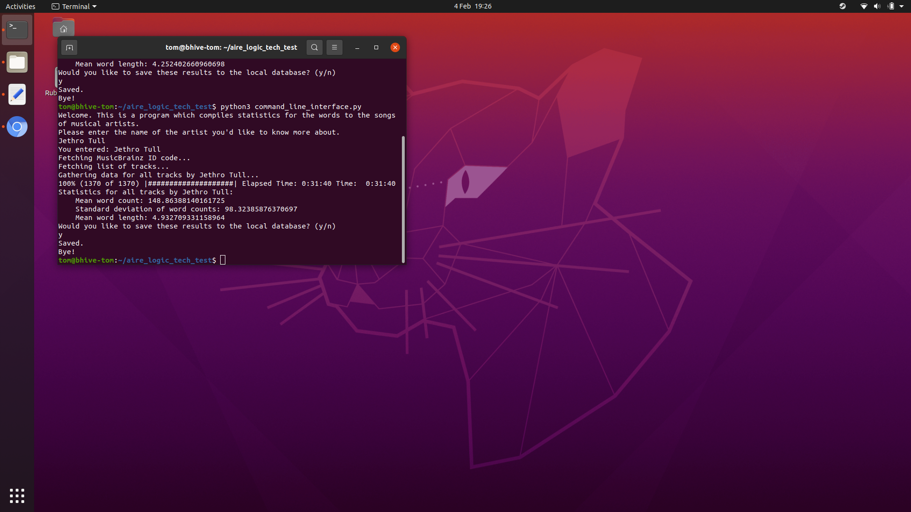

# Aire Logic Tech Test

As per [the problem sheet](problem_sheet.pdf), I've made a program which, given a string naming a given musical artist, provides the **mean word count per track** for that artist. It also provides the standard deviation of word count per track, and the overall mean word length. The user enters the desired artist's name by means of a **command line interface**, and is then provided with the above statistics by the same function.

## Getting Started

This program was intended to run on an **Ubuntu device**, with an internet connection, with Python 3 and PIP3 already installed, as follows:

1. Download or clone a copy of this repository to your home directory.
1. Open up a terminal and navigate to the directory containing said copy.
1. Install the program's third party requirements by running `sh installer`.
1. Run the program using `python3 command_line_interface.py`.
1. The results of previous searches can be found by inspecting the file **`data.db`**.
    * This local database also serves as a cache, **greatly speeding up searches** where an artist's data have previously been stored locally.

## Technical Details

### Files

This program was built using **Python**. Four of the `.py` files define **classes**:

* `artist.py` defines the Artist class.
* `command_line_interface.py` defines the CommandLineInterface class.
* `db_manager.py` defines the DBManager class.
* `track.py` defines the Track class.

The remaining `.py` files define small libraries for gathering XML and JSON data structures from the internet.

### Structure

The **Artist class** is the keystone of the program. It builds up statistics for a given artist as follows:

1. The Artist constructor takes a `human_readable_name` as its sole argument.
1. The Artist object then searches through MusicBrainz for artists of that name, and grabs the *MusicBrainz ID* (MBID) of the top result.
1. The Artist object then searches through MusicBrainz a second time, this time using the MBID, to build a set of the titles of all the artist's recordings.
1. The Artist object then goes through all the items in the set of titles of recordings.
    1. The Artist object builds a list of objects of the **Track class**.
    1. Each Track object interrogates lyrics.ovh for the words to that track.
    1. Having got the words, each Track object then compiles its own statistics about them.
1. The Artist object collates the statistics for the various tracks on its list.
1. Using an instance of the **DBManager class** the Artist object can then, if desired, save the statistics collected onto a local database.

### Testing

* For those .py files that have unit tests, these can be run simply by running `python3 [filename]`. (Running `python3 command_line_interface.py` will start the program; for the other .py files without unit tests, running `python3 [filename]` will have no effect.)
* I tested the program as a whole by giving it to my dad, and telling him to do his worst. **HE WAS THE ONE RESPONSIBLE FOR SEARCHING FOR LEONARD COHEN, AND NOT ME.**
* I also tested the program as a whole by typing in gobbledygook.

## Further Development

I tried to put this program together quite quickly, and so I'm conscious of a number of flaws:

* The sites from which I gathered my data only allow one query per second. **This makes the program take forever.**
* My code assumes that MusicBrainz and lyrics.ovh are perfectly innocent. If someone were to cause these sites' URLs to return malicious code, all hell could break loose.
* The command line interface could be daunting for a non-programmer.

And I'm sure there is room for improvement in several other areas which I haven't yet countenanced.
